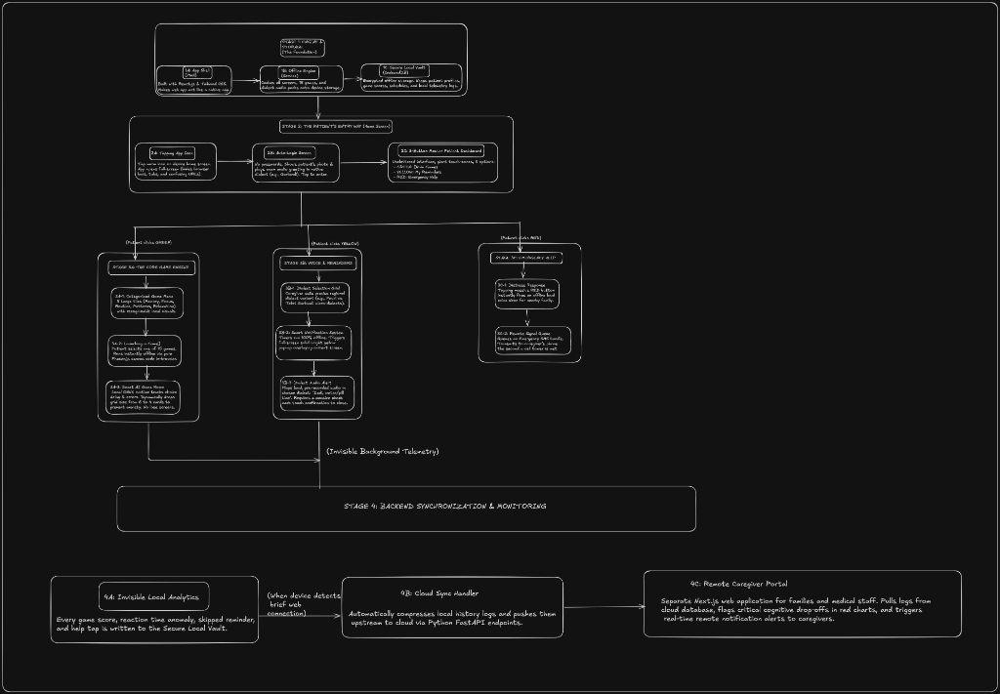

# CARE — Caring And Remembering Everyday 🧠

**Smart India Hackathon (SIH) 2026 — Problem Statement 26003**
*AI-Based Cognitive Gaming and Memory Assistance Platform for Elderly Dementia Patients*

## Overview

CARE (Caring And Remembering Everyday) is an offline-first, Progressive Web App (PWA) designed to aid elderly individuals experiencing dementia or cognitive decline. By combining cognitive puzzles, voice interaction, and emergency assistance in a highly accessible interface, CARE helps users maintain mental acuity and stay safe. 

The platform is designed with extreme privacy in mind, utilizing a Secure Local Vault (C++/WASM) to encrypt sensitive telemetry data entirely on the device.

## Architecture



The project is built on a 4-Stage architectural pipeline designed to bridge high-performance systems programming with modern, accessible web interfaces.

## Project Structure & Roadmap

### Stage 1: Foundation (App Shell & Security)
*Establish the offline-first web shell and the high-performance local security engine.*

- **✅ Stage 1A: Next.js PWA App Shell**
  - Fully offline-ready using Service Workers.
  - Elderly-friendly UI design (high contrast, warm color palette, large touch targets, no complex navigation).
  - App Manifest configured for native-like installation on Android/iOS.
- **🔄 Stage 1B & 1C: Secure Local Vault & Math Core (C++/WASM)**
  - `vault_core.cpp`: Core C++ logic written for XOR-based encryption and anonymization hashing.
  - `math_core.cpp`: Core scoring logic written.
  - *(Pending)*: Implement Emscripten bindings to expose the C++ functions to JavaScript and store encrypted data in IndexedDB.

### Stage 2: Offline Persistence & Sync Layer
*Ensuring seamless offline capability with background sync.*

- **❌ Stage 2A: IndexedDB Wrapper**
  - Define local schemas for storing offline activity.
- **❌ Stage 2B: FastAPI Sync Backend (Optional/Future)**
  - Set up a lightweight Python FastAPI server to sync encrypted telemetry when the user comes back online.

### Stage 3: Feature Modules (The "App" layer)
*Building the actual tools and games for the elderly users.*

- **❌ Stage 3A: Cognitive Games**
  - "Memory Match" or "Pattern Recall" games, piping scoring data into the WASM `math_core`.
- **❌ Stage 3B: Voice & Memory Assistant**
  - Audio recording features and playback for memory anchoring.
- **❌ Stage 3C: Emergency / Help**
  - Quick-access SOS module for immediate caregiver alerts.

### Stage 4: AI & Analytics
*Making sense of the telemetry data without compromising privacy.*

- **❌ Stage 4A: On-Device Analytics UI**
  - Dashboard showing the user's streaks, scores, and cognitive trends (populated by local data).
- **❌ Stage 4B: AI Integration**
  - Prompt engineering and local/remote LLM hooks for analyzing the anonymized telemetry to provide caregiver insights.

## Technologies Used
- **Frontend**: Next.js 16 (App Router), React, Tailwind CSS
- **PWA**: Custom Service Workers, Web Manifest
- **Core Engine**: C++, WebAssembly (WASM), Emscripten
- **Data Privacy**: Local-first Encryption (XOR/AES)

## Getting Started

### Prerequisites
- Node.js (v18+)
- Emscripten (for compiling C++ to WASM)

### Running the Web App Locally
```bash
cd frontend
npm install
npm run dev
```
Open `http://localhost:3000` in your browser. To view the mobile PWA experience, connect your mobile device to the same local network and navigate to the Network IP provided in the terminal.
